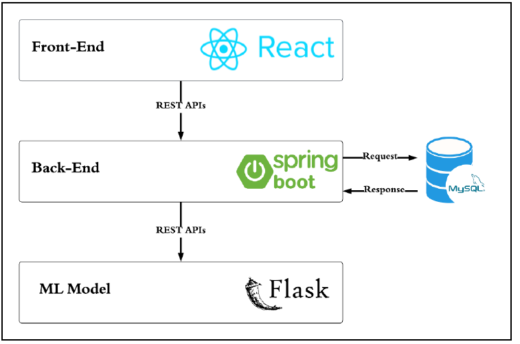

# GloucoGuide — Diabetes Health Management Platform (Graduation Project)

GloucoGuide is a full-stack health management platform designed to support diabetes patients with **personalized insights**, **predictive machine learning analysis**, **secure health data management**, and **location-based healthcare assistance**.  
This project demonstrates strong skills in **backend engineering**, **full-stack development**, **machine learning**, and **cloud deployment**.

---

## 🚀 Project Summary

GloucoGuide combines software engineering and machine learning to help diabetes patients make informed decisions through:

- Personalized health insights  
- Lifestyle and habit recommendations  
- Predictive ML-based risk analysis  
- Secure user authentication and data management  
- Healthcare service navigation via Google Maps API  

---

## 🏗️ Tech Stack

### **Backend**
- Java • Spring Boot  
- Spring Security
- MySQL  
- REST API Architecture  

### **Frontend**
- React.js (Component-based UI)

### **Machine Learning**
- Python • Flask  
- Predictive ML models for diabetes risk analysis  
- Flask microservice deployment  

### **Cloud & Integrations**
- Microsoft Azure  
- Google Maps API  

---

## 🔧 My Role in the Project

- Designed and developed the **backend system** using Spring Boot  
  - REST APIs  
  - Database schema design  
  - Authentication & authorization (Spring Security)

- Implemented **machine learning models** for predictive health insights  
  - Feature engineering  
  - Model training & evaluation  
  - Flask microservice deployment

- Integrated ML microservice with Java backend  
- Integrated Google Maps API for clinics, labs, and pharmacies  

---

## ✨ Key Features

### 🔹 Personalized Health Insights  
Machine learning–powered predictions and tailored recommendations.

### 🔹 Secure Health Data Management  
Encrypted storage for glucose levels, weight, symptoms, and other health metrics.

### 🔹 Lifestyle Guidance  
Custom recommendations for diet, exercise, and wellness.

### 🔹 Predictive Analytics  
ML models that provide risk scores and forecast potential health issues.

### 🔹 Location-Based Medical Assistance  
Google Maps API integration to help users locate:  
- Nearby clinics  
- Labs  
- Pharmacies  

### 🔹 Full-Stack Web Platform  
React frontend + Spring Boot backend + Flask ML service.

